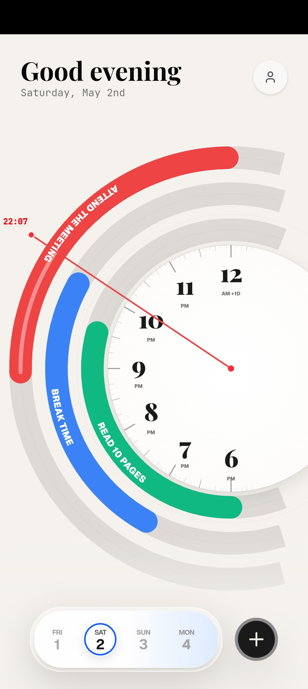
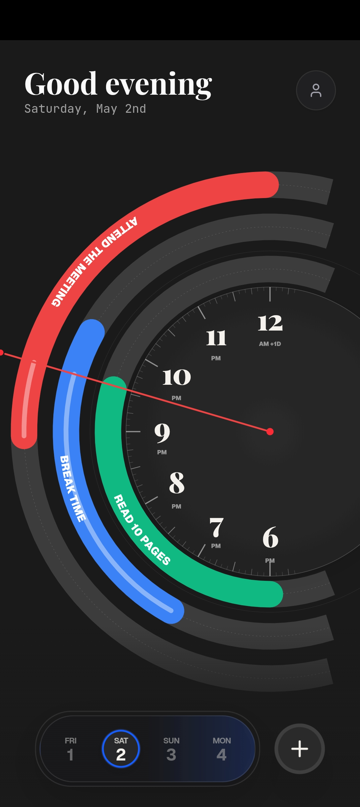
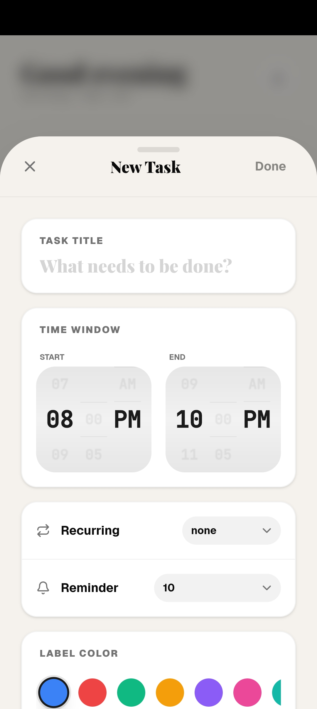
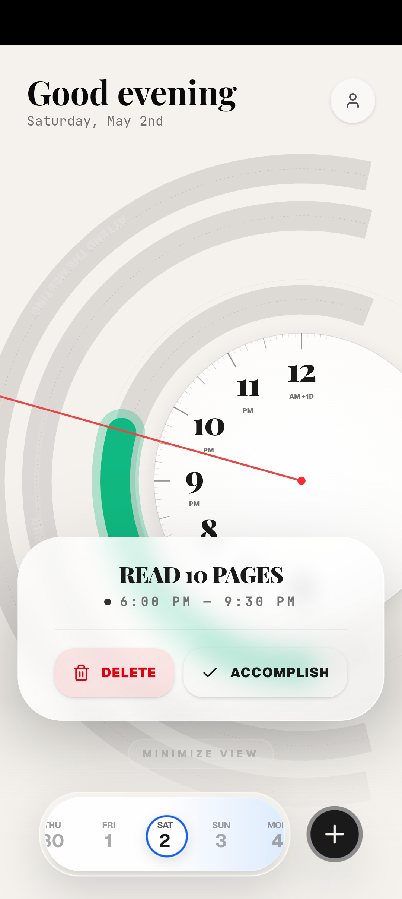
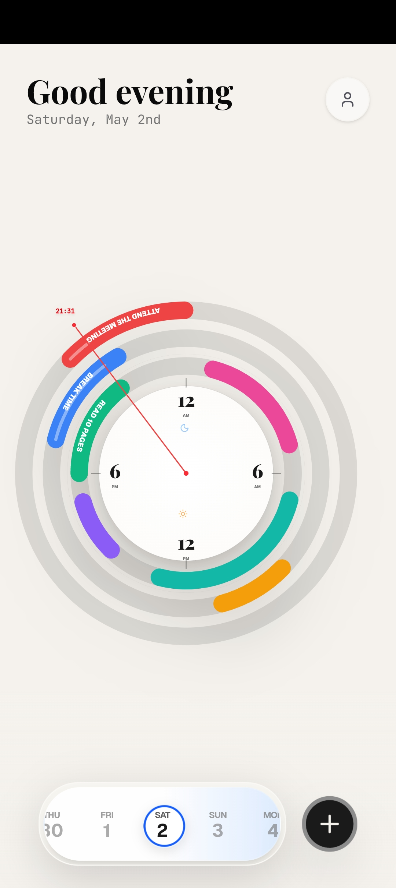
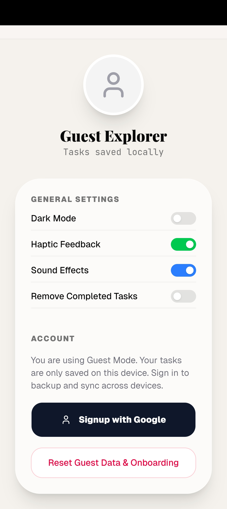

# 🕐 Chronos Planner

A radial clock-based daily planner that maps your tasks as arc strips on a real clock face — so you see exactly where your time goes, not just a list you ignore.

---

## Features

- **Radial Clock UI** — Tasks are displayed as colored arc strips on a circular clock face
- **Smart Overlap Detection** — Overlapping tasks automatically stack on outer rings, keeping the view clean
- **Real-time Clock Hand** — A live clock hand sweeps across your tasks, fading completed portions
- **Label System** — Assign colors to tasks and set them to repeat daily or weekly
- **Reminders** — Get notified before a task begins with sound and haptic feedback
- **Multiple Clock Modes** — Switch between Radial arc view, Summary clock, or 24-hour ring
- **Date Jump** — Tap the greeting text at the top to instantly jump to any date
- **Google Sign-In** — Sync your tasks across devices via Firebase Authentication
- **Onboarding Flow** — Beautiful sepia-themed welcome screens for first-time users

---

## Screenshots

<div align="center">


&nbsp;

&nbsp;


<br/><br/>


&nbsp;

&nbsp;


</div>

## Built With

- **React + Vite** — Frontend framework
- **SVG** — Radial clock and arc rendering
- **Firebase Authentication** — Google Sign-In
- **Vercel** — Deployment and hosting
- **shadcn/ui** — UI components

---

## Live Demo

 [chronos-planner1.vercel.app](https://chronos-planner1.vercel.app)

---

## Installation

```bash
# Clone the repository
git clone https://github.com/aryanbaidya/chronos-planner1.git

# Navigate into the project
cd chronos-planner1

# Install dependencies
npm install

# Start the development server
npm run dev
```

---

## Environment Variables

Create a `.env` file in the root directory and add your Gemini API key:

```
REACT_APP_GEMINI_API_KEY=your_api_key_here
```

---

## Project Structure

```
chronos-planner/
├── public/
│   ├── icon.png
│   ├── manifest.json
│   └── sw.js
├── src/
│   ├── components/
│   ├── pages/
│   └── main.jsx
├── index.html
└── package.json
```

---

## Roadmap

- [ ] Offline support via Service Worker
- [ ] Firebase Firestore for cloud task storage
- [ ] Push notifications for reminders

---

---

## License

This project is licensed under the MIT License.
